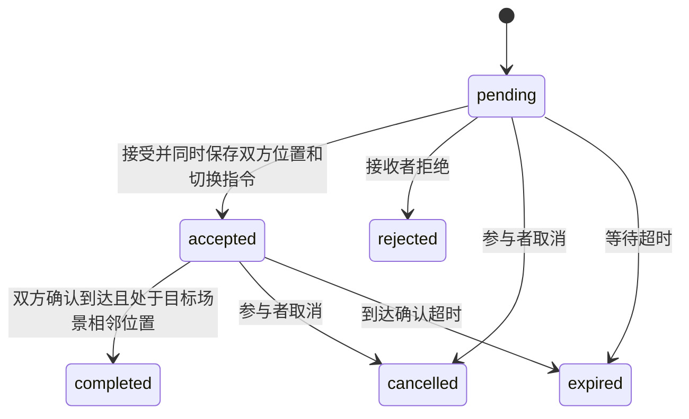

# 后端修复与双人邀请

角色领取使用 `role_claims` 永久台账。旧账号已有角色会自动补入台账；领取、账号、会话一起提交。注销或账号解除角色不会释放角色。远端账号用户名和角色各有唯一约束，台账不能覆盖或删除，八账号容量也由远端约束保护。

邀请状态：

每次接受会把双方放在目标场景的两个相邻可通行点，释放旧座位和设备，停止原来的自主活动，保留手中物品。客户端按 `travelId` 执行一次切换，切换过程中停止提交旧位置；后端拒绝没有当前编号的位置更新。邀请结束不会撤销已接受的场景切换指令，因此断线、超时后重连仍能恢复位置。重复操作不会创建新邀请、重复传送或重复写入碰面经历。新邀请需要新的请求编号。不同实例的真人使用持久位置参与显示和到达判定，不会被加入自主控制。

远端同步先取启动水位再读取快照，增量水位只有本地事务成功提交后才前进。恢复和增量应用都使用按主键更新，约束冲突和外键错误会明确失败。关键 HTTP 操作暂存响应与事件，以一个带版本检查的远端事务提交状态和操作回执；失败则回滚本地状态并返回 409 或 503。慢速上传在进入写队列前读取，断线清理在保存点结束后执行。

普通移动、前端家具边界和自主寻路使用共享通行规则，座位与设备操作保留专门锚点校验。后台世界更新有异常边界。原有像素素材和界面风格继续使用。

验证：全量 `npm test`、`npm run build`，以及 `node scripts/verify-invites.mjs` 的双浏览器五场景邀请、携带物品和刷新恢复。专项覆盖两个独立副本争抢角色、邀请互斥、同值物品冲突、同步回滚重试、启动同步竞态、跨实例到达与 SSE 同场景可见、永久锁和非法地点。

独立复核：功能审查 APPROVE；架构 WATCH，无本轮阻断。后续关注座位和设备占用的全局互斥、提交延迟的监控。生产迁移及部署尚未执行；若旧远端已有重复角色或损坏外键，新约束会阻止启动，应先备份并人工核对原账号及会话，不能静默覆盖账号。
